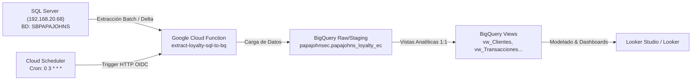

# 🍕 Papa John's Ecuador — Data Pipeline & BI

Pipeline automatizado de datos para migrar información desde **SQL Server** (`SBPAPAJOHNS`) hacia **Google BigQuery** (`papajohnsec.papajohns_loyalty_ec`) mediante **Google Cloud Functions (Gen2)** y **Cloud Scheduler**, preparando la capa analítica para **Looker**.

---

## 🏗️ Arquitectura del Pipeline



---

## 📂 Estructura del Repositorio

```text
PapaJohnsEc/
├── .env.example                       # Plantilla de variables de entorno
├── .gitignore                         # Exclusión de credenciales y venvs
├── README.md                          # Documentación general
├── MEMORY.md                          # Memoria persistente del proyecto
├── functions/
│   └── extract_loyalty/               # Código de la Cloud Function (Gen2)
│       ├── config.py                  # Lectura de configuraciones y Pydantic
│       ├── database.py                # Consultas y extracción de SQL Server
│       ├── bigquery_loader.py         # Carga y validación de esquemas en BigQuery
│       ├── main.py                    # Entrypoint HTTP (Functions Framework)
│       └── requirements.txt           # Dependencias de Python
├── sql/
│   └── views/                         # 8 Vistas analíticas estándar
│       ├── 01_vw_Clientes.sql
│       ├── 02_vw_ClientesDetalles.sql
│       ├── 03_vw_Transacciones.sql
│       ├── 04_vw_Puntos.sql
│       ├── 05_vw_PuntosBono.sql
│       ├── 06_vw_Canjes.sql
│       ├── 07_vw_Cash.sql
│       └── 08_vw_wallet_txn_base.sql
├── references/                        # DDLs y esquemas de referencia
│   └── timhortons_loyalty_structure.sql
└── scripts/                           # Automatización y despliegue
    ├── deploy_function.ps1            # Despliegue en Windows PowerShell
    ├── deploy_function.sh             # Despliegue en Linux / Cloud Shell
    └── create_views.py                # Creación automática de vistas en BQ
```

---

## 📊 Tablas Base y Vistas

### Tablas Base Sincronizadas
1. `Accounts`
2. `RetailTransactionHeaders`
3. `RetailTransactionDetails`
4. `RetailTransactionCash` (mapeado desde `CashMovements`)
5. `Bonus`
6. `SubEntity` (mapeado desde `SubEntities`)
7. `SRewards` (enriquecido con `Benefits`)
8. `RewardRedemptions`
9. `TransactionTypes`

### Vistas Analíticas
* **`vw_Clientes`**: Clientes consolidados con estado de actividad y saldos de puntos/cash.
* **`vw_ClientesDetalles`**: Vista detallada con movimientos combinados de bonos y cabeceras.
* **`vw_Transacciones`**: Ventas por tienda, cajero y tipo de transacción con nombre del cliente.
* **`vw_Puntos`**: Puntos acumulados, redimidos y disponibles por transacción.
* **`vw_PuntosBono`**: Bonificaciones especiales otorgadas por cuenta.
* **`vw_Canjes`**: Recompensas redimidas por los socios.
* **`vw_Cash`**: Movimientos de billetera / cash depositado vs cambiado.
* **`vw_wallet_txn_base`**: Ledger transaccional con saldo acumulado temporal y zona horaria `America/Guayaquil`.

---

## 🚀 Despliegue

### Requisitos Previos en Google Cloud:
El usuario `melissah@loymark.com` o la Service Account debe contar con los roles:
* `roles/bigquery.admin` o `roles/bigquery.dataEditor` en el proyecto `papajohnsec`.
* `roles/cloudfunctions.developer`
* `roles/cloudscheduler.admin`

### Ejecución del Despliegue:
En PowerShell:
```powershell
.\scripts\deploy_function.ps1
```
